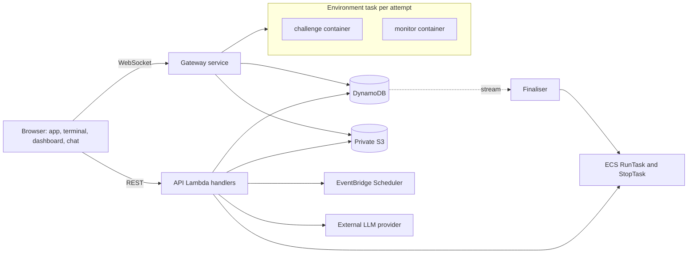
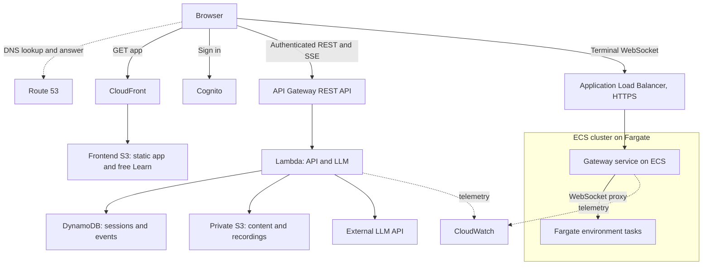

# Architecture

Status: implementation proposal consistent with the preliminary report. The
[reference Challenge image](../content/challenges/wrong-upstream-port/README.md) runs
locally. Platform handlers, the gateway, the monitor, and cloud resources are not implemented.

This document owns the service layout. The domain contracts own detailed behaviour, as
defined in the [decision register](decisions/README.md). Diagrams are views of these
contracts, not independent requirements. Record the revision and proposal status when
sharing one. A detailed drawing does not make an open choice settled.

## Components

All three modes share one web application, account system, and progress store.

| Component | Responsibility |
| --- | --- |
| Web app | Static pages, catalogue, Learn, Code Review, Challenge workspace, debrief, playback |
| API handlers | Identity, plans, catalogue, sessions, tickets, hints, timeline, debrief, playback, reviews, LLM turns |
| Lifecycle handlers | Readiness from ECS task events, time limits from Scheduler, heartbeat sweep, reconciliation |
| Finaliser | Waits for a bounded recording drain, stops the task, releases the lock, derives the debrief and score from sealed data, updates progress |
| Gateway service | Ticket checks, terminal proxy, dashboard stream, session recording across browser disconnects, final drain, command events, proposal runs, heartbeats |
| Challenge container | Service stack, planted fault, supervisor, terminal server |
| Monitor container | Traffic, metrics, validators, health probes, captures |

The API handlers are separate Lambda functions that share modules and contracts. LLM
turns run in their own function so they have separate concurrency and timeout limits.
They are not separate microservices. The gateway is the only component that talks to
environment tasks. Lambda handlers stay outside the VPC.

## Proposed AWS deployment

The deployment uses one Region. The Region, domain, and IaC tool are open.

These figures show component relationships, not every request and response. Route 53
resolves names. Application traffic goes directly to the resolved entry point.

**Entry and web tier.** Route 53 hosts the domain and maps each subdomain to its entry
point with alias records: the web app to CloudFront, the API to API Gateway, terminals
to the ALB, and sign-in to Cognito. Route 53 health checks can fail over to a static
maintenance endpoint. CloudFront serves the web app and free Learn pages from S3. Cognito
identifies users. The backend checks session ownership and plan entitlement on every
request.

**API and state.** A Regional API Gateway REST API routes requests to stateless Lambda
handlers. The LLM route streams responses, which REST APIs support. The cheaper HTTP API
lacks streaming and has a 30-second integration limit. Lambda remains billed while it
waits for the model, even after the client disconnects, so provider deadlines, token
limits, and a separate concurrency budget bound AI use. DynamoDB stores progress,
sessions, per-command timeline events, review submissions, and conversation history,
all read by key. Terminal recordings and log captures exceed DynamoDB's item size, so
they go to private S3. Session start and end use conditional writes keyed by request ID,
so a retry cannot launch a second task or record a result twice. See the
[data model](data-model.md).

**Challenge environments.** To start a Challenge, a handler calls ECS `RunTask` with the
Challenge's task definition, pinned to ECR image digests, and later stores the task's
private address in DynamoDB. An EventBridge Scheduler job stops the task at the time
limit, and a missed heartbeat stops abandoned tasks sooner. Scheduler fires with
one-minute precision, which the time limit tolerates. Completed one-time schedules still
count against the Scheduler quota, so the finaliser deletes them. See
[Challenge environments](challenges.md).

**Gateway service.** Terminal and dashboard traffic uses WebSockets. The gateway is our
own small WebSocket proxy, run as an ECS service in the same Fargate cluster as the
environment tasks. It validates a short-lived ticket, looks up the learner's task
address, proxies the terminal, relays the monitor's dashboard stream, and records the
stream outside the learner's reach. The ALB only terminates HTTPS and spreads connections
across gateway copies. It does not balance environment tasks. The ALB idle timeout stays
above the heartbeat interval. See the [gateway protocol](api.md#terminal-gateway-protocol).

**Warm pool.** A small pool of started, unassigned tasks can hide start-up time before a
scheduled class. A session claims a pooled task through a conditional write. Scores and
counters count from `readyAt`, so time a task spends waiting in the pool is excluded.
Pooled tasks cost money while idle and expire after a bounded wait. The pool is optional
and follows the first milestone.

## Network and isolation

| Placement | Resources | Inbound | Outbound |
| --- | --- | --- | --- |
| Public subnets | ALB | HTTPS from the internet | Gateway service |
| Private subnets | Gateway service | ALB only | Environment tasks, VPC endpoints |
| Private subnets | Environment tasks | Gateway service only, on terminal and monitor ports | VPC endpoints for image pulls and monitor logs |

Each Fargate task has its own isolation boundary and shares no kernel, CPU, memory, or
network interface with other tasks. Environment tasks have no internet route and no task
IAM role, so root shells expose no AWS credentials. CPU, memory, and time caps limit
misuse. Containers inside one task share a network namespace. A sidecar and a plaintext
secret do not protect monitor traffic from a root shell. Require authenticated TLS with
task identity verification, remove `NET_RAW` and other unnecessary capabilities, and do
not share the monitor's process namespace or secret storage. See the
[monitor controls](challenges.md#monitor). Validate these controls on Fargate before
hosted access. They protect the measurement process, not the truth of learner-written
logs or configuration.

Private subnets use VPC endpoints instead of a NAT gateway: ECR API and Docker registry
endpoints, an S3 gateway endpoint for image layers and gateway writes, a DynamoDB gateway
endpoint, and a CloudWatch Logs endpoint. Endpoint policies allow only what the gateway
and image pulls need. The VPC resolver remains reachable from private subnets. Isolation
tests must check DNS egress, and a Route 53 Resolver DNS Firewall allow list is the
proposed control if names outside the endpoint set resolve. Challenge CoreDNS
configurations never forward to an upstream resolver.

| Principal | Allowed |
| --- | --- |
| Session handlers | `ecs:RunTask` on Challenge task definition families, `iam:PassRole` for the environment execution role only, `ecs:StopTask`, `DescribeTasks`, and `ListTasks` on the cluster, Scheduler operations on session schedules, table access, content reads, pre-signed reads of session objects |
| LLM handler | Table access for turns and proposals, the provider credential |
| Gateway task role | Session items and tickets in the table, `PutObject` under `sessions/` |
| Environment execution role | Image pulls and monitor log delivery |
| Environment task role | None |

The challenge container's output is not shipped to CloudWatch by default, because the
learner controls it. Enable it only in development environments.

## Trade-offs

Per-session tasks add compute cost, start-up latency of tens of seconds, vCPU quotas that
cap concurrent sessions, and AWS-specific integration. Fargate also disallows privileged
containers, so environments cannot run nested Docker. A single Docker host has fewer
components, but needs provisioned capacity and isolates learners' root shells less
strongly. The same images run under local Docker for testing and on any container host,
which supports the on-premise comparison.

Fargate Spot would lower compute cost but can interrupt a task with a two-minute warning.
Interrupting a learner mid-incident is worse than the saving, so it is not the default.
AWS can also retire Fargate tasks for platform maintenance, which ends a session as
`error` without using up the first attempt.

Keep domain logic, repositories, and the environment launcher behind ports, so the same
behaviour can run on-premise. Compare equivalent authentication, persistence, isolation,
monitoring, and availability, with the same external LLM.

## Local-first development

Start with the local reference image, then connect session control through a Docker
launcher adapter, an in-memory repository, and a development identity. Add the monitor
and gateway in focused increments. The integrated environment has two containers with
a shared network namespace and watched-file volume. Prove that local environment path
before the AWS spike, without waiting for every subsystem to be complete. Production
configuration must reject development identity.

Local tests prove image behaviour, validators, recording, and domain logic. They do not
prove Cognito, IAM, VPC isolation, Fargate start-up time, quotas, WebSockets through the
ALB, or REST API streaming. The AWS spike proves those.

## Operational requirements before a hosted pilot

- Deployment configuration validates secrets, identity mode, allowed origins, and the
  cluster, subnets, and security groups each handler may use.
- Budgets and alarms cover running task count, Fargate vCPU use against quota, LLM spend,
  API errors, and throttling.
- The reconciliation sweep runs on a schedule and alarms when it stops an orphaned task.
- Correlation IDs connect API requests, session events, gateway connections, and
  provider timings.
- Logs omit tickets, monitor secrets, provider credentials, full prompts, terminal
  content, and review concerns.
- Per-learner rate limits and the one-active-session limit are enforced before exposure.
- Verify backup and restore, and a small rollback deployment. Published Challenge
  versions keep their task definition revisions for existing sessions.

These are delivery acceptance criteria, not claims of production readiness.
