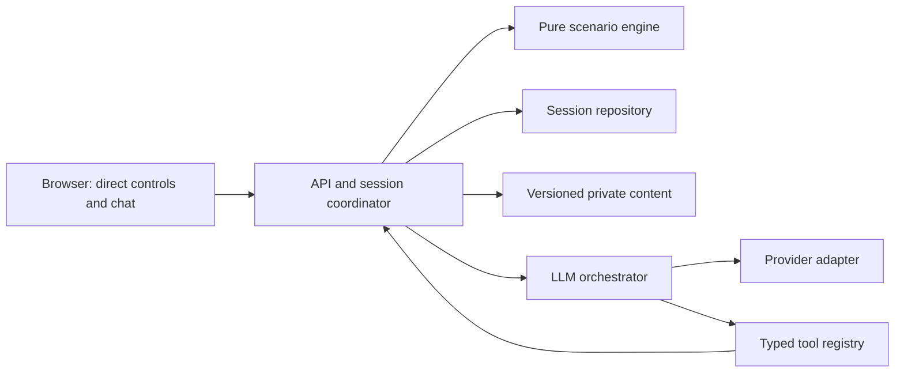
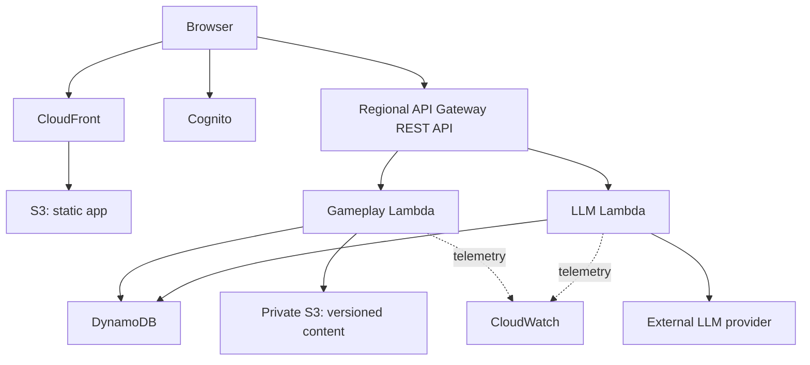

# Architecture

Status: the local modular monolith is implemented. The AWS deployment below
remains a proposal. No cloud resources or LLM handlers are implemented.

## Application boundaries

The API coordinates authentication, access, requests, and persistence. The engine
accepts a validated command and state, then returns new state and logical events.
It has no network, environment-variable, database, or clock dependencies.

The tool registry owns names, argument schemas, operation kind, and confirmation
requirements. Scenario data selects which operations and targets are available.
The LLM has no direct repository or engine mutation access. The API executes its
requests through the same coordinator as direct controls.

Separate public projections from private records with explicit allowlists. Never
serialize a private session and remove a few known hidden fields afterward.

## Proposed AWS deployment

Separate handlers give LLM requests their own concurrency and timeout limits.
They share application modules and state contracts. They are not separate
microservices. Authentication identifies the caller. Every handler also checks
ownership and content access. Frontend and private content must use separate
storage and deployment paths.

The REST message route uses response streaming to support the complete
tool-selection, validated-execution, and explanation loop. AWS REST APIs support
streaming. HTTP APIs do not and have a 30-second integration limit. Node.js managed
Lambda runtimes support streaming. Region and runtime support must be verified
in the early deployment spike. See [official references](references.md).

Streaming does not reduce LLM computation. Lambda can keep running and billing
after the browser disconnects. Use provider deadlines, token/tool limits, and
persisted action results. Do not keep a database transaction open during an LLM
request or across a human confirmation.

## State coordination

For an accepted action, the coordinator authenticates, reads state, validates
schema/availability/prerequisites, runs the pure engine, and atomically commits
the next state, logical event batch, receipt, and any checkpoint. The commit
conditions on the expected state version and absence of the request receipt.
Concurrent winners are serialized by the database. Losing requests receive a
conflict and do not silently rerun against different state.

Request receipts survive beyond database transaction-token windows. Repeated
request IDs with identical payloads return the original result. Reuse with a
different payload is a conflict. Ownership is always checked before receipt
lookup. See [data model](data-model.md) and [API](api.md).

## Local-first development

The React/Vite app calls a loopback Fastify process through a same-origin proxy.
SQLite uses WAL and atomic transactions for sessions, receipts, checkpoints, and
events. Tests use temporary database files. Explicit local accounts use signed
HTTP-only cookies. The entry point rejects `NODE_ENV=production`.

The browser validates public responses and keeps a separate query cache per
learner. A session version guard prevents late reads or receipts from replacing
newer state. Pending writes are saved in tab storage before dispatch, and retries
reuse the request ID. See [local persistence](decisions/002-local-persistence.md).

Run API contract tests against both local and DynamoDB adapters when implemented.
Local tests prove domain and adapter behaviour, not Cognito, IAM, regional
streaming, quotas, or AWS failure handling. The cloud spike proves those paths.

Use `npm run dev` for API and frontend reload, or `npm run build` then `npm start`
to check the built frontend with the same API. Both stay on loopback addresses.
See [development](development.md) for storage and recovery procedures.

## Deployment trade-offs

Serverless hosting suits independent sessions and intermittent classes. It reduces
idle compute and server maintenance but adds cold starts, service limits, and AWS
integration. A single application server with PostgreSQL has fewer deployment
components and flexible queries, but needs capacity planning and maintenance.

Keep the domain and repository ports independent of AWS so the same behaviour can
be hosted on-premise. Compare equivalent authentication, persistence, monitoring,
availability assumptions, and the same external LLM. Do not compare a full cloud
service with an on-premise process that omits required capabilities.

## Operational requirements before a hosted pilot

- Deployment configuration validates secrets, identity mode, and allowed origins.
- Least-privilege IAM separates content reads and session writes from deployment.
- Correlation IDs connect API, action receipts, and provider timings. Logical game
  events remain separate from application logs.
- Logs omit credentials, full prompts, hidden evidence, and personal submissions.
- Alerts cover server errors, write conflicts, provider failure, throttling, and cost.
- Set request, storage, provider, and per-user rate limits before exposing the app.
- Verify backup/restore and a small rollback deployment. Published scenario
  versions remain available to existing sessions.

These are delivery acceptance criteria, not claims of production readiness.
