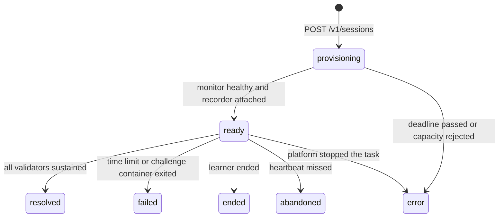

# Challenge environments

Status: proposed v0.2 runtime contract, following the preliminary report. It replaces the
earlier simulated engine. The three [Challenge manifests](../content/challenges/README.md)
are drafts. A [local reference image](../content/challenges/wrong-upstream-port/README.md)
implements the wrong-upstream-port service stack and image tests. The
[monitor](../apps/monitor/README.md) implements local traffic, recovery, outage checks,
and authenticated HTTPS control. A gateway controller can record, resume, and seal this
monitor stream through an injected sink. The reference image has a private interactive
terminal server, and the gateway has a locally tested client for its private protocol.
Monitor captures, the terminal recording stream, the deployed durable recording store,
browser terminal access, and the complete running gateway do not exist yet. Storage
adapters for monitor recordings are implemented and tested locally. Numbers
marked proposed are starting values to measure, not results. The full task and publication
requirements below remain unproven.

## Principle

Each Challenge runs real services with one planted misconfiguration. Learners investigate
with ordinary tools and repair real files. There is no fixed action list. Any valid fix
restores service, and mistakes have real effects. Consequences come from system
behaviour, not from authored rules. Automated validators decide recovery.

Time is wall-clock time. Traffic continues while the learner reads logs, waits for the
assistant, or leaves the tab, so failed requests accumulate while the fault remains.

## Environment task

Starting a Challenge runs one Fargate task with two containers:

| Container   | Contents                                                                                                                                                  | Learner access  |
| ----------- | --------------------------------------------------------------------------------------------------------------------------------------------------------- | --------------- |
| `challenge` | The Challenge image: the service stack under a process supervisor, and a terminal server that gives the learner a root shell                              | Full root shell |
| `monitor`   | The shared monitor image, configured by the manifest: traffic generator, metrics, validators, health probes, captures, and a control port for the gateway | None            |

The containers share the task's network namespace, so the monitor reaches services over
localhost. Watched configuration and log paths are shared with the monitor read-only
through a task volume. Prove the volume layout when integrating the first monitor. A separate
container protects the monitor's files and processes only when its storage and PID
namespace are private. Shared networking still needs the controls below. Learners can
alter the service responses and files being measured, but not the saved recording.

The challenge container is essential. The monitor verifies the initial incident state
before the session becomes ready. Initial listener checks are for startup only. Do not
use learner-controlled service ports as Docker or ECS liveness checks. After readiness,
a stopped service is part of the incident, not a reason to end the container. Images
provide `service <name> start|stop|restart|reload` wrappers over the supervisor so familiar
commands work.

Task settings:

- CPU and memory come from the manifest. The time limit also caps cost.
- No task IAM role, so a root shell exposes no AWS credentials. The execution role only
  pulls images and delivers monitor logs. ECS Exec stays disabled.
- Private subnets with no internet route. The security group accepts inbound traffic only
  from the gateway service, on the terminal and monitor ports. Egress reaches only the VPC
  endpoints needed for image pulls and monitor logs.
- Images are pinned by digest in the task definition revision for each Challenge version.
- Fargate disallows privileged containers, so there is no nested Docker. It allows adding
  only the `SYS_PTRACE` capability. See the [Fargate references](references.md).
- Do not add `SYS_PTRACE` or `NET_ADMIN`. Drop `NET_RAW` and every default capability
  the image does not need. Record the tested capability set with each image. Keep the
  monitor's root filesystem read-only, with a private bounded buffer volume. Reserve
  monitor CPU and memory so challenge load cannot silently stop measurement.

The same two images run under local Docker for development and scenario tests, with a
shared network namespace and volume.

## Private terminal server

The reference Challenge image listens on private TCP port 7681 and owns one root Bash
PTY. The endpoint is not an authentication boundary. The future gateway must authenticate
the learner, authorize the session, and consume a terminal ticket before it connects.
The task security group must accept this port only from the gateway.

The private protocol is newline-delimited JSON. Each frame is at most 24 KiB. The first
frame must be an `attach` frame with protocol version 1, mode `interactive`, a positive
input generation, and terminal dimensions from 1 to 500. A successful attach returns
`ready`. Input and output bytes use base64. Decoded input is at most 16 KiB. `resize` and
`heartbeat` use the installed generation. Complete PTY writes return `input_accepted`.
A partial write or timeout returns `INPUT_UNCERTAIN`; callers must not automatically
retry it.

The server serializes generation installation with input and resize operations. A larger
generation replaces the active connection and closes it with `REPLACED`. It rejects an
older attach or operation with `STALE_GENERATION`. The shell stays alive across ordinary
connection loss. While no client is attached, the server keeps the latest 64 KiB of
output. The next `ready` frame reports `replayTruncated: true` if older bytes were dropped.
This replay buffer has no durable sequence cursor and is not the terminal recording
stream.

The gateway's private terminal client validates this protocol, serializes operations,
and applies output backpressure. It does not retry an input whose acknowledgement is
lost. The caller must supply a generation that a later gateway session layer claims from
authoritative session state. Browser authentication and relay remain separate.

At most eight clients can wait or attach. An unattached client has five seconds to send
its first frame. An attached client has a 45-second idle limit. Terminal bytes are not
written to process logs. The server does not restart inside the same container. A marker
under `/run/opsreplay-terminal` prevents a process or container restart from silently
opening a new shell after the in-memory generation fence is lost. The lifecycle must
treat that loss as an environment error. A new task starts with a new container and a
new marker. Bash ignores up to ten consecutive Ctrl-D inputs at an empty prompt. An
explicit `exit` terminates the terminal. The server watches the Bash process directly,
so a background process that keeps the PTY open cannot hide that exit.

## Lifecycle

1. **Provisioning.** The monitor verifies the initial state: aggregate recovery fails
   (at least one validator fails) and every health probe passes. These checks are not
   learner measurements. Only then does its health check pass.
   A failed verification is an image defect. The session ends as `error` with
   `start_failed` and is logged for authors. One lifecycle routine owns launch,
   readiness, schedules, and cleanup. API calls, session stream events, ECS events,
   and the sweep invoke it from saved state. It repairs interrupted starts without a
   browser retry. See the [start contract](api.md#start).
2. **Ready.** The lifecycle handler saves the healthy task's address. A gateway claims
   recording ownership and acknowledges its initial terminal and monitor cursors before
   measurement starts. The measurement origin is committed as `readyAt`, so start-up
   latency is not charged to the learner. The alert is shown.
3. **Outcome.** The first outcome wins through a conditional write:
   - `resolved` when every validator has passed continuously for its sustain period;
   - `failed` with `time_limit` when the EventBridge Scheduler job fires;
   - `failed` with `environment_exited` when the challenge container exits, for example
     after the learner kills its supervisor;
   - `ended` with `learner_ended`;
   - `abandoned` with `heartbeat_missed` when `lastSeenAt` is older than five minutes
     (proposed), found by a sweep that runs every minute;
   - `error` with `environment_exited` when the platform stops the task for another
     reason.
     A lost or unhealthy monitor ends the attempt as a platform `error`, not recovery or
     zero impact. Recording becomes incomplete if its final samples cannot be recovered.
4. **Drain.** The outcome write also fixes `endedAt`, sets recording to `draining`, and
   sets `drainDeadlineAt`, proposed at 30 seconds later and always within the shared
   one-minute post-session window. These values never move on a retry. Input closes when
   the gateway observes the outcome. Activity after `endedAt` is excluded from scoring,
   even if a command was still running. The gateway asks the monitor to seal measurements
   at that cutoff and uploads the remaining terminal, metric, event, and capture data. It
   acknowledges `complete` only after the saved objects and events cover the final
   cursors with no gaps. A limit or unrecoverable gap produces `incomplete` with a reason.
   Neither state changes the session outcome.
5. **Finalisation.** The session stream and sweep call the same finaliser. It waits for
   recording completion before `StopTask`. If the recorder or task is lost, or the drain
   deadline expires, it seals the saved data as `incomplete` and stops the task. It never
   waits indefinitely for an acknowledgement. Once the task is confirmed stopped, it
   deletes the schedule and commits the debrief, progress, and finalisation marker once.
   Lock release is conditional on the lock still naming this session. A session that
   never became ready has no debrief. Reconciliation retries each unfinished step and
   discovers late tasks through ECS events and session tags, including pending tasks.
   It follows the drain rule before stopping a task with an outcome.

The drain deadline bounds the wait for recording, not AWS service recovery. Stop failures
remain pending for reconciliation and raise an alarm. The active-session lock remains
until cleanup is confirmed. Lambda never contacts the monitor. Gateway acknowledgements
and finalisation requests pass through stored session state.

An attempt labelled `first` is the learner's first attempt of that Challenge ID that did
not end in `error`. Environment faults never use up the first attempt.

## Monitor

**Traffic.** The monitor runs each manifest journey at its rate. A journey stops at its
first failed step. A step fails on an unexpected status, a connection error, or a
timeout. Every step counts toward `totalRequests`, and failed steps toward
`failedRequests`, from `readyAt` to the outcome. Request completion timestamps define
the cutoff. The monitor retains enough timestamped data to seal counters at `endedAt`
even when the gateway learns of the outcome later.

**Dashboard.** Request rate, error rate, and latency percentiles come from the monitor's
own traffic. CPU and memory for the challenge container come from the task metadata
endpoint's `/task/stats` path on Fargate, or from container statistics locally. Samples
are taken every five seconds (proposed).

The first monitor increment uses five-second samples. Rate, errors, and exact nearest-rank
p95 use ordinary requests completed in the preceding five seconds. Empty windows omit
error rate and latency. CPU and memory are omitted until the runtime adapter exists.
See the [measurement definitions](../apps/monitor/README.md#measurements). These partial
samples do not claim complete dashboard or recording support.

**Validators.** Each validator is evaluated every second (proposed). The aggregate
recovery state is `sustaining` while all pass, and `met` when each has passed
continuously for its own sustain period. Any failure resets the state to `failing` and
emits `recovery_lost`. The learner sees only the aggregate state.

HTTP status checks prove availability only. The `checkout` check also proves a minimum
business operation. For each run, generate a fresh reference, POST
`{"reference":"<reference>"}` to `/api/checkout`, require 201 with a JSON object whose
`id` is a non-empty identifier, `reference` matches, and `status` is `confirmed`, then
GET `/api/orders/<id>`. Require 200 and the same three fields. IDs use 1 to 128 ASCII
letters, digits, underscores, or hyphens. Both requests use the authored loopback
`baseUrl`, no redirects, a per-request timeout, and a 64 KiB response limit. Invalid JSON,
missing fields, a stale reference, or a failed read fails the check. This fixed check is
not a general assertion language and does not prove resistance to a deliberately forged
service. Image tests must verify the stored order and bound the test data volume.
Ordinary traffic may omit `reference`, in which case the image generates one. Validator
requests supply their own fresh reference so an old response cannot satisfy a new run.

Run each validator without overlap. A failed evaluation resets its passing window. A
missed scheduler slot resets the window only when no evaluation is already running. A
slow in-flight evaluation remains authoritative, then its completed result advances or
resets the window. Validator and probe requests are separate from the journey counters.
The three draft Challenges require both their journey and the checkout check, so the
slow order-history path is still tested where applicable.

**Health probes.** Probes pass at the start. A probe that fails continuously for its
grace period starts an outage. The outage event's time is the first failed check. The
outage ends when the probe passes again. Each probe has a public label that names the
symptom without revealing the cause.

**Captures.** After each command the recorder asks the monitor for a capture using a
stable command event ID. The monitor assigns a sequence on first receipt and replays it
for duplicate requests. It records changed watched files as bounded diffs, new log
lines, and a metric sample. Each capture includes `baselineAt` (the prior capture's start,
or the initial baseline's start), `startedAt`, and `completedAt`. These times and
`commandSeq` appear in the saved object and playback manifest. The gateway stores the
object in S3.

Reads are not an atomic filesystem snapshot. A later command or background process can
change a file before it is read. `commandSeq` identifies the capture request, not the
cause of every change. Show the interval and do not label a diff as changes made by that
command. The interval begins at the prior read start because files can change while a
capture is in progress. Serialize captures, not shell input. Establish the initial
watched-file baseline before readiness. Truncated or missing captures carry the recording's
missing-data notice.

**Control port.** Because the learner's shell shares the network namespace, it can reach
the monitor's port. Use TLS with the monitor's task identity verified by the gateway and
a per-session secret for gateway authentication. The working default is a per-task
certificate pinned in the private session record. Its key and the secret go only to the
monitor, never to the challenge container, a shared volume, or logs. The gateway must
verify the certificate before sending the secret. Plaintext control connections fail
closed. Bound request sizes and rates, including unauthenticated requests. Authenticate
gateway readiness checks so invalid traffic cannot consume their rate allowance. The
control port never returns validator or probe
definitions. The monitor keeps the session's samples, signals, and captures locally,
bounded, and serves them from a sequence number, so a reconnecting gateway can fetch
anything it missed.

The current local runtime listens on port 9443 with TLS 1.3. `GET /healthz` returns only
`starting`, `ready`, or `failed`. It and all control operations require the session secret.
The operations start measurement, read at most 100 public frames after a sequence cursor,
and seal at the immutable lifecycle cutoff. A retry with the same start or cutoff is safe.
A different cutoff is rejected. The monitor reserves an accepted cutoff before any wait,
so later reads cannot return records beyond it. Frames already relayed before the gateway
learns the outcome remain provisional. The gateway must discard records after `endedAt`
and replace the live view with sealed data. The monitor can wait briefly for its monotonic
clock to reach the supplied cutoff, but it does not alter that timestamp.

The root learner can still disrupt its own task network and prevent a later gateway
reconnection. Connection limits are resource bounds, not an availability boundary. A lost
monitor makes the recording incomplete and the attempt a platform error with no score.
Stronger denial-of-service isolation requires a separate network trust boundary. The
certificate delivery and task-address publication path is implemented locally but is
not deployed. The gateway supervisor is not implemented.

**Untrusted files.** Watched files are written by a root learner. The monitor reads only
regular files, never follows symbolic links, and caps the bytes it reads. Otherwise a
link could make it capture its own secret or another file from the monitor container.

## Command recording

The gateway records terminal input and output as timestamped asciicast v2 chunks outside
the learner's reach. Playback shows output. Input supports command reconstruction.

The complete recording design belongs to the session, not the browser connection. One gateway holds a
renewable recorder lease, proposed at 15 seconds with renewal every five seconds. It
keeps reading the terminal and monitor after the browser disconnects. Gateway workers
discover unclaimed or expired leases through the session work index. A replacement
increments the recorder generation and resumes from saved cursors. A future terminal
recording stream must buffer sequenced output for bounded reconnects, as the monitor does for its data.
A buffer overflow or missing range is recorded, never treated as an empty interval.
Only the recorder creates command events and requests captures. A browser may connect
through another gateway copy, which proxies input and output but does not record them
again. The current private terminal server implements only the interactive stream. The
separate read-only recording stream and recorder reconnection are deferred.

Chunks have immutable keys that include the recorder generation and sequence range.
The gateway saves object references and event cursors only after successful uploads,
conditional on its current lease and recording still being open. Stale writers cannot
publish objects or complete a drain. Finalisation fixes the accepted references so late
uploads cannot change playback or scores. Unreferenced objects expire under retention.

The future shell configuration must emit prompt and command markers, such as the OSC 133
sequences terminals use for shell integration. They mark prompt start, command start with
the command line, and command end with the exit status. The gateway removes them from the
forwarded stream and uses them to form command events. Without markers, it falls back to
input lines submitted at an idle prompt. Markers come from inside the learner's container
and can be altered. That affects only that learner's command events and the debrief items
derived from them. Monitor measurements are unaffected.

A command's output excerpt is the output between its start and end, with control
sequences removed and full-screen program output, such as `vi` or `less`, omitted. It is
bounded to 4,000 characters with a truncation flag. Lines typed inside a program the
command started, such as SQL at a `psql` prompt, are kept with that command for evidence
matching.

## Scoring

The first implementation reports raw components only. Weights and any combined score
remain open.

| Component                          | Definition                                                                                        |
| ---------------------------------- | ------------------------------------------------------------------------------------------------- |
| `timeToRecoverySeconds`            | From `readyAt` to the start of the final sustained passing window. Null unless resolved           |
| `totalRequests`, `failedRequests`  | Monitor counters from `readyAt` to the outcome                                                    |
| `commandCount`                     | Recorded commands, as the proposed measure of investigation effort                                |
| `observedOutages`, `outageSeconds` | Health probe outage count and summed duration per probe. These do not assert who caused an outage |
| Assistance                         | Hints released, assistant turns, and proposals run                                                |

Reduced impact counts even when the root cause remains, because a mitigation lowers
`failedRequests`. Time to recovery starts at the passing window, not at its end, so the
sustain period is confirmation rather than a penalty.
Durations are seconds and may include fractions. Overlapping outages of different probes
each contribute their duration, so this component can exceed the session's elapsed time.

## Debrief derivation

The finaliser derives the debrief from the manifest and the recorded timeline:

1. **Key evidence** has a status. `observed` requires a matching `commandPatterns` rule
   and every `outputPatterns` rule to match the saved output excerpt of that same
   completed command. The first observed match gives `commandSeq`. A command match
   without matching output is `attempted`, with the first attempt's sequence. Otherwise
   it is `not_observed`, with a null sequence. This does not prove the learner missed or
   understood the evidence. Patterns are case-sensitive JavaScript regular expressions
   over at most 4,000 characters. A path mention, file-change capture, or full-screen
   editor with no saved output cannot establish that the original evidence was seen.
2. **Outages** come from monitor outage events. They have no automatic command cause.
3. **Possible harmful actions** match a trap's command pattern and precede an outage
   of its probe within the authored window. Each association includes `commandSeq` and
   `outageStartedAt`. This is a possible explanation based on timing, not proof of cause.
4. **Root cause, causal chain, and recommended recovery** are authored text.
5. **Assisted** is true when any hint, assistant turn, or proposal was used.

The saved session's `readyAt` and `endedAt` define the bounds, even if recording loss
removed lifecycle events. Only events within those bounds enter the derivation. A command
that completes after the cutoff cannot supply observed evidence. Terminal output is
learner-controlled, so these matches support reflection, not trusted assessment.
Unsupported command forms may remain `not_observed`. Monitor data alone determines
recovery and request impact.

The debrief aligns commands with metric samples and capture intervals. It shows state
observed around those commands, not proven per-command causation. The repository check
runs these rules against the
[example timeline](../packages/contracts/examples/timeline.json) and compares the result
with the [example debrief](../packages/contracts/examples/debrief.json).

An incomplete recording still permits a debrief of the saved data, with a visible
`recording.status: incomplete` and reason. Its `score` is null. Missing measurements
must not become zero, and missing records must not be described as learner mistakes.
Progress saves the outcome and the missing-score status without a numeric ranking.

## Playback and retry

After the debrief, the learner can play back the attempt as a timeline. The terminal
recording runs in step with the metric series and timestamped capture intervals. Key
evidence, possible harmful actions, outages, and the start of recovery are highlighted.
Outage and recovery highlights point to their event time with a null `commandSeq`. Playback
reads stored data. It never restarts an environment.

A retry starts a fresh task from the current published version. It is labelled `retry`
and never changes the first attempt, its debrief, or its score.

## Scenario validity harness

Each image version needs scripted evidence before publication:

1. Start a fresh environment and confirm the fault is present: validators fail and
   probes pass. With multiple validators, at least one must fail. Unaffected checks may pass.
2. Run the reference fix and confirm every validator is met within its sustain period
   plus a margin.
3. For each trap, in a fresh environment, run its commands and confirm its probe fails.
   Run the safe alternative, when defined, and confirm the probe keeps passing.
4. Repeat each Challenge 20 times to expose flaky environments and measure the variance
   in recovery time.
5. Play back each reference run and confirm that it matches its recorded output, logs,
   and metrics.

Locally the harness runs commands with `docker exec`. On Fargate there is no ECS Exec,
so it drives the terminal through the gateway like a learner, which also tests
recording.
