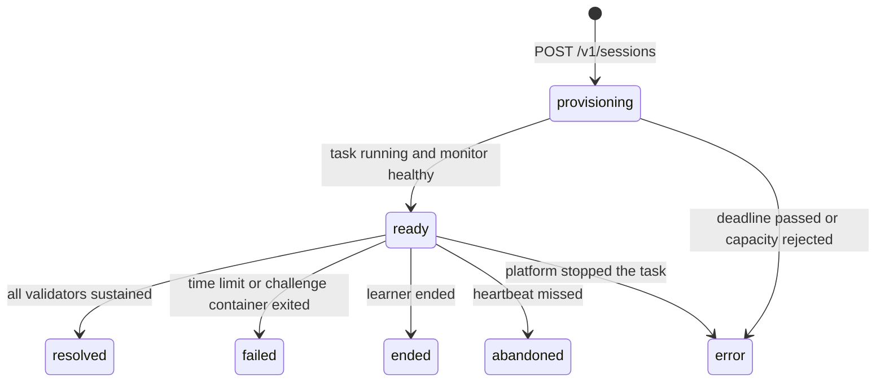

# Challenge environments

Status: proposed v0.2 runtime contract, following the preliminary report. It replaces the
earlier simulated engine. The three [Challenge manifests](../content/challenges/README.md)
are drafts. No Challenge image, monitor, or gateway exists yet. Numbers marked proposed
are starting values to measure, not results.

## Principle

Each Challenge runs real services with one planted misconfiguration. Learners investigate
with ordinary tools and repair real files. There is no fixed action list. Any valid fix
restores service, and mistakes have real effects. Consequences come from system
behaviour, not from authored rules. Automated validators decide recovery.

Time is wall-clock time. Traffic continues while the learner reads logs, waits for the
assistant, or leaves the tab, so failed requests accumulate while the fault remains.

## Environment task

Starting a Challenge runs one Fargate task with two containers:

| Container | Contents | Learner access |
| --- | --- | --- |
| `challenge` | The Challenge image: the service stack under a process supervisor, and a terminal server that gives the learner a root shell | Full root shell |
| `monitor` | The shared monitor image, configured by the manifest: traffic generator, metrics, validators, health probes, captures, and a control port for the gateway | None |

The containers share the task's network namespace, so the monitor reaches services over
localhost. Watched configuration and log paths are shared with the monitor read-only
through a task volume. The exact volume layout is proven with the first image. Keeping
the monitor in its own container stops learners from altering measurements.

The challenge container is essential. The monitor starts after the challenge container
reports its services running. Images provide `service <name> start|stop|restart|reload`
wrappers over the supervisor so familiar commands work.

Task settings:

- CPU and memory come from the manifest. The time limit also caps cost.
- No task IAM role, so a root shell exposes no AWS credentials. The execution role only
  pulls images and delivers monitor logs. ECS Exec stays disabled.
- Private subnets with no internet route. The security group accepts inbound traffic only
  from the gateway service, on the terminal and monitor ports. Egress reaches only the VPC
  endpoints needed for image pulls and monitor logs.
- Images are pinned by digest in the task definition revision for each Challenge version.
- Fargate disallows privileged containers, so there is no nested Docker. It allows adding
  only the `SYS_PTRACE` capability. See the [Fargate references](references.md).

The same two images run under local Docker for development and scenario tests, with a
shared network namespace and volume.

## Lifecycle

1. **Provisioning.** The monitor starts traffic and verifies the initial state: every
   validator fails and every health probe passes. Only then does its health check pass.
   A failed verification is an image defect. The session ends as `error` with
   `start_failed` and is logged for authors. One lifecycle routine owns launch,
   readiness, schedules, and cleanup. API calls, session stream events, ECS events,
   and the sweep invoke it from saved state. It repairs interrupted starts without a
   browser retry. See the [start contract](api.md#start).
2. **Ready.** The lifecycle handler saves the healthy task's address. A gateway claims
   recording ownership and acknowledges its initial terminal and monitor cursors before
   readiness is committed. The time limit starts at `readyAt`, so start-up latency is
   not charged to the learner. The alert is shown.
3. **Outcome.** The first outcome wins through a conditional write:
   - `resolved` when every validator has passed continuously for its sustain period;
   - `failed` with `time_limit` when the EventBridge Scheduler job fires;
   - `failed` with `environment_exited` when the challenge container exits, for example
     after the learner kills its supervisor;
   - `ended` with `learner_ended`;
   - `abandoned` with `heartbeat_missed` when `lastSeenAt` is older than five minutes
     (proposed), found by a sweep that runs every minute;
   - `error` with `environment_exited` when the platform stops the task for another
     reason.
4. **Drain.** The outcome write also fixes `endedAt`, sets recording to `draining`, and
   sets `drainDeadlineAt`, proposed at 30 seconds later. These values never move on a
   retry. Input closes when the gateway observes the outcome. Activity after `endedAt`
   is excluded from scoring, even if a command was still running. The gateway asks the
   monitor to seal measurements at that cutoff and uploads the remaining terminal,
   metric, event, and capture data. It acknowledges `complete` only after the saved
   objects and events cover the final cursors with no gaps. A limit or unrecoverable gap
   produces `incomplete` with a reason. Neither state changes the session outcome.
5. **Finalisation.** The session stream and sweep call the same finaliser. It waits for
   recording completion before `StopTask`. If the recorder or task is lost, or the drain
   deadline expires, it seals the saved data as `incomplete` and stops the task. It never
   waits indefinitely for an acknowledgement. Once the task is confirmed stopped, it
   deletes the schedule and commits the debrief, progress, and finalisation marker once.
   Lock release is conditional on the lock still naming this session. A session that
   never became ready has no debrief. Reconciliation retries each unfinished step and
   discovers late tasks through ECS events and session tags, including pending tasks.
   It follows the drain rule before stopping a task with an outcome.

The drain deadline bounds the wait for recording, not AWS service recovery. Stop failures
remain pending for reconciliation and raise an alarm. The active-session lock remains
until cleanup is confirmed. Lambda never contacts the monitor. Gateway acknowledgements
and finalisation requests pass through stored session state.

An attempt labelled `first` is the learner's first attempt of that Challenge ID that did
not end in `error`. Environment faults never use up the first attempt.

## Monitor

**Traffic.** The monitor runs each manifest journey at its rate. A journey stops at its
first failed step. A step fails on an unexpected status, a connection error, or a
timeout. Every step counts toward `totalRequests`, and failed steps toward
`failedRequests`, from `readyAt` to the outcome.

**Dashboard.** Request rate, error rate, and latency percentiles come from the monitor's
own traffic. CPU and memory for the challenge container come from the task metadata
endpoint's `/task/stats` path on Fargate, or from container statistics locally. Samples
are taken every five seconds (proposed).

**Validators.** Each validator is evaluated every second (proposed). The aggregate
recovery state is `sustaining` while all pass, and `met` when each has passed
continuously for its own sustain period. Any failure resets the state to `failing` and
emits `recovery_lost`. The learner sees only the aggregate state.

**Health probes.** Probes pass at the start. A probe that fails continuously for its
grace period starts an outage. The outage event's time is the first failed check. The
outage ends when the probe passes again. Each probe has a public label that names the
symptom without revealing the cause.

**Captures.** After each command the gateway asks the monitor for a capture. The
monitor assigns the next command sequence number and records the changed watched
configuration files as bounded diffs, new lines in each watched log, and the current
metric sample. The gateway stores the capture in S3.

**Control port.** Because the learner's shell shares the network namespace, it can reach
the monitor's port. The monitor therefore requires a per-session secret, passed only to
the monitor container as a `RunTask` environment override and stored on the private
session record for the gateway. The control port never returns validator or probe
definitions. The monitor keeps the session's samples, signals, and captures locally,
bounded, and serves them from a sequence number, so a reconnecting gateway can fetch
anything it missed.

**Untrusted files.** Watched files are written by a root learner. The monitor reads only
regular files, never follows symbolic links, and caps the bytes it reads. Otherwise a
link could make it capture its own secret or another file from the monitor container.

## Command recording

The gateway records terminal input and output as timestamped asciicast v2 chunks outside
the learner's reach. Playback shows output. Input supports command reconstruction.

Recording belongs to the session, not the browser connection. One gateway holds a
renewable recorder lease, proposed at 15 seconds with renewal every five seconds. It
keeps reading the terminal and monitor after the browser disconnects. Gateway workers
discover unclaimed or expired leases through the session work index. A replacement
increments the recorder generation and resumes from saved cursors. The terminal server
must buffer sequenced output for bounded reconnects, as the monitor does for its data.
A buffer overflow or missing range is recorded, never treated as an empty interval.

Chunks have immutable keys that include the recorder generation and sequence range.
The gateway saves object references and event cursors only after successful uploads,
conditional on its current lease and recording still being open. Stale writers cannot
publish objects or complete a drain. Finalisation fixes the accepted references so late
uploads cannot change playback or scores. Unreferenced objects expire under retention.

The image's shell configuration emits prompt and command markers, such as the OSC 133
sequences terminals use for shell integration. They mark prompt start, command start with
the command line, and command end with the exit status. The gateway removes them from the
forwarded stream and uses them to form command events. Without markers, it falls back to
input lines submitted at an idle prompt. Markers come from inside the learner's container
and can be altered. That affects only that learner's command events and the debrief items
derived from them. Monitor measurements are unaffected.

A command's output excerpt is the output between its start and end, with control
sequences removed and full-screen program output, such as `vi` or `less`, omitted. It is
bounded to 4,000 characters with a truncation flag. Lines typed inside a program the
command started, such as SQL at a `psql` prompt, are kept with that command for evidence
matching.

## Scoring

The first implementation reports raw components only. Weights and any combined score
remain open.

| Component | Definition |
| --- | --- |
| `timeToRecoverySeconds` | From `readyAt` to the start of the final sustained passing window. Null unless resolved |
| `totalRequests`, `failedRequests` | Monitor counters from `readyAt` to the outcome |
| `commandCount` | Recorded commands, as the proposed measure of investigation effort |
| `selfInflictedOutages`, `outageSeconds` | Health probe outages and their total duration |
| Assistance | Hints released, assistant turns, and proposals run |

Reduced impact counts even when the root cause remains, because a mitigation lowers
`failedRequests`. Time to recovery starts at the passing window, not at its end, so the
sustain period is confirmation rather than a penalty.

## Debrief derivation

The finaliser derives the debrief from the manifest and the recorded timeline:

1. **Key evidence** is found when a command line, or a line typed inside a program it
   started, matches one of its patterns. The first match gives `commandSeq`. Patterns are
   JavaScript regular expressions, matched case-sensitively against at most 4,000
   characters.
2. **Outages** come from monitor outage events. Each is attributed to the last command
   that started at or before it.
3. **Harmful actions** are commands that match a trap's patterns and are followed by an
   outage of that trap's probe within the trap's window.
4. **Root cause, causal chain, and recommended recovery** are authored text.
5. **Assisted** is true when any hint, assistant turn, or proposal was used.

The debrief aligns commands with metric samples and captures, so it can show what each
action changed. The repository check runs these rules against the
[example timeline](../packages/contracts/examples/timeline.json) and compares the result
with the [example debrief](../packages/contracts/examples/debrief.json).

An incomplete recording still permits a debrief of the saved data, with a visible
`recording.status: incomplete` and reason. Its `score` is null. Missing measurements
must not become zero, and missing records must not be described as learner mistakes.
Progress saves the outcome and the missing-score status without a numeric ranking.

## Playback and retry

After the debrief, the learner can play back the attempt as a timeline. The terminal
recording runs in step with the metric series and the capture for each command. Key
evidence, harmful actions, outages, and the start of recovery are highlighted. Playback
reads stored data. It never restarts an environment.

A retry starts a fresh task from the current published version. It is labelled `retry`
and never changes the first attempt, its debrief, or its score.

## Scenario validity harness

Each image version needs scripted evidence before publication:

1. Start a fresh environment and confirm the fault is present: validators fail and
   probes pass.
2. Run the reference fix and confirm every validator is met within its sustain period
   plus a margin.
3. For each trap, in a fresh environment, run its commands and confirm its probe fails.
   Run the safe alternative, when defined, and confirm the probe keeps passing.
4. Repeat each Challenge 20 times to expose flaky environments and measure the variance
   in recovery time.
5. Play back each reference run and confirm that it matches its recorded output, logs,
   and metrics.

Locally the harness runs commands with `docker exec`. On Fargate there is no ECS Exec,
so it drives the terminal through the gateway like a learner, which also tests
recording.
